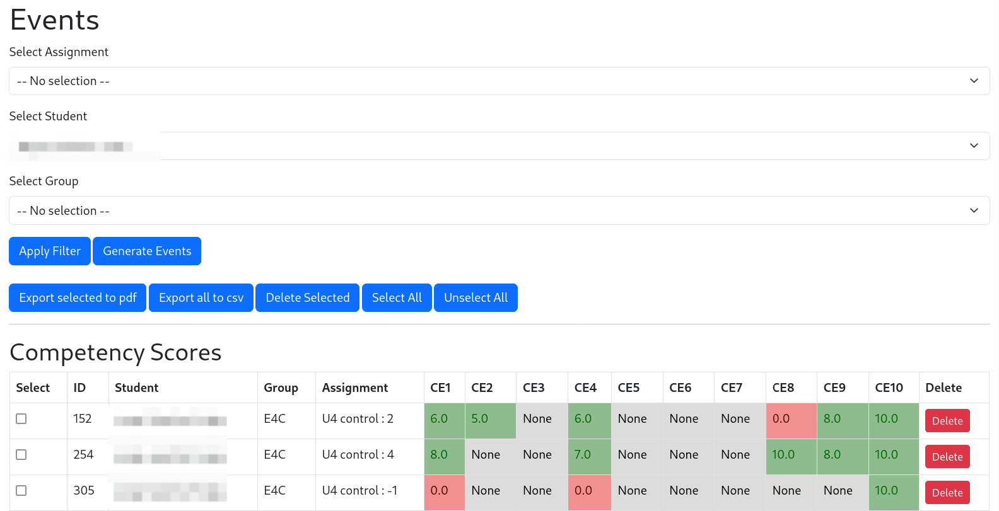

# Flask Student Management Application

This is a web application built with **Flask** for managing student assignments, events, and groups. It allows you to perform various actions like importing student data, creating and managing assignments, and viewing and editing event records. The application also supports exporting filtered data to a CSV and PDF format.

## Features

- **Student Management**
  - Upload a list of students from a CSV file.
  - View and manage student records, including their associated groups.
  
- **Assignment Management**
  - View and manage assignments, with the ability to add, edit, and delete assignments.

- **Event Management**
  - View event records associated with students and assignments.
  - Edit competency values for each student in relation to a specific assignment.
  - Filter and export event data to CSV and PDF formats.
  
- **Group Management**
  - Manage student groups and link students to specific groups.

## Prerequisites

Before running the project, make sure you have the following installed:

- **Python 3.x**
- **Flask** (web framework for Python)
- **SQLite** (database for storing application data)

### Install Flask and Other Dependencies

To install the required Python dependencies, create a virtual environment and install the dependencies using `pip`.

```bash
# Create a virtual environment
python3 -m venv venv

# Activate the virtual environment
# On Windows
venv\Scripts\activate
# On macOS/Linux
source venv/bin/activate

# Install the dependencies
pip install flask pandas
```
## Project Structure

Here is an overview of the project structure:
```
/your_project/
    /static/
        /js/
            events.js              # JavaScript file for event management
            editable_cells.js      # JavaScript for cell management
        /css/
            style.css              # Style file    
    /templates/
        index.html                # Index page template
        assignments.html          # Assignments page template
        students.html             # Students page template
        events.html               # Events page template
    /routes/ 
        assignments.py
        events.py
        students.ppy
    /data/                        # Directory for CSV student list files
    /instance/                    # SQLite database    
    app.py                        # Main Flask application
    models.py                     # Database Model (see below)
    LICENSE                       # Project LICENSE
    README.md                     # Project README
```

## Database Model

This project uses **SQLite** to store the following tables:

- **Student**: Stores student information (name, ID, group).
  - Columns: `id`, `name`, `group_id`
  
- **Group**: Stores group information (name, ID).
  - Columns: `id`, `name`

- **Assignment**: Stores assignment details (exercise number, tag).
  - Columns: `id`, `exercise_number`, `assignment_tag`
  
- **Event**: Stores student assignment events, including competency values (CE1, CE2, ..., CE10).
  - Columns: `id`, `id_student`, `id_assignment`, `CE1`, `CE2`, ..., `CE10`

### Example Model Code

Here is the structure of the models in `app.py` using SQLAlchemy:

```python
from flask_sqlalchemy import SQLAlchemy

db = SQLAlchemy()


class Student(db.Model):
    id = db.Column(db.Integer, primary_key=True)
    name = db.Column(db.String(100), nullable=False)
    id_group = db.Column(db.Integer, db.ForeignKey('group.id'), nullable=False)


class Group(db.Model):
    id = db.Column(db.Integer, primary_key=True)
    name = db.Column(db.String(10), unique=True, nullable=False)


class Assignment(db.Model):
    id = db.Column(db.Integer, primary_key=True)
    exercise_number = db.Column(db.Integer, nullable=False)
    assignment_tag = db.Column(db.String(100), nullable=False)


class Event(db.Model):
    id = db.Column(db.Integer, primary_key=True)
    id_student = db.Column(db.Integer, db.ForeignKey('student.id'), nullable=False)
    id_assignment = db.Column(db.Integer, db.ForeignKey('assignment.id'), nullable=False)
    id_group = db.Column(db.Integer, db.ForeignKey('group.id'), nullable=False)
    CE1 = db.Column(db.Float, nullable=True)
    CE2 = db.Column(db.Float, nullable=True)
    CE3 = db.Column(db.Float, nullable=True)
    CE4 = db.Column(db.Float, nullable=True)
    CE5 = db.Column(db.Float, nullable=True)
    CE6 = db.Column(db.Float, nullable=True)
    CE7 = db.Column(db.Float, nullable=True)
    CE8 = db.Column(db.Float, nullable=True)
    CE9 = db.Column(db.Float, nullable=True)
    CE10 = db.Column(db.Float, nullable=True)
```
## Database Setup

The database will be created automatically when the application runs for the first time. To ensure the database is set up, you can run the `create_all()` method in `app.py`.

```python
# This will create the necessary tables in the SQLite database.
from app import db
db.create_all()
```

# Running the Application

To run the application locally, use the following steps:

1. Make sure you have activated your virtual environment.
2. Run the Flask app using the following command:

```bash
python app.py
```

3. The app will be available at http://127.0.0.1:5000/ in your browser.
   
### Available Routes

- **`/`** - Displays the main student list and management interface.
- **`/events`** - Displays the event management interface, where you can edit event data and view assignment details.
- **`/create_events`** - Creates events for a given assignment, for one student or for all
- **`/delete_student/<student_id>`** - Deletes a student from the database.
- **`/delete_event/<event_id>`** - Deletes an event record.
- **`/delete_selected_events`** - Deletes a list of selected event records.
- **`/update_event`** - Updates the marks given to a competency.
- **`/filter_by_form`** - Filters the event data based on selected student or assignment.

## Usage
### Load student list
   Go to the student tab and upload a csv whose structure is given by `data/student_list.csv`.
### Add assignments 
   Go to the assignments tab and create new assignments
### Generate events
   Filter for an assignment of your choice and generate events for it. You can start 
assigning marks to the competencies! Then you can filter for student, for group, 
for assignment.



## JavaScript Integration

The application contains **JavaScript** code to handle dynamic operations such as:

- Editable table cells for events (competencies).
- Toggle visibility of rows based on checkboxes.
- Export filtered data to CSV or PDF formats.

The JavaScript file is located in the `static/js/` folder.

### Exporting Data to CSV

You can export filtered student or event data to a CSV file by clicking the **Export all to CSV** button after applying your desired filters.

### Exporting Data to PDF

The application also supports exporting event data to a **PDF** file using the **Export selected to PDF** button. 
This feature is powered by the **jsPDF** library on the frontend. It will export the 
selected events only.

### Select/Unselect all
These two buttons supports selection of all events at once and the 
opposite, unchecking all checkboxes at once. 

## Customizing the Application

The application is easily extendable. You can add more tables or routes to meet your requirements. For example:

- Add additional fields to the **Event** table (e.g., new competencies).
- Implement additional views for student or assignment details.
- Add user authentication or roles for better security.

<!---## Troubleshooting

- **404 Errors for Static Files**: If the static JavaScript or CSS files are not loading, ensure they are placed in the correct `static` directory and correctly linked in the HTML templates.
- **Database Issues**: If you encounter issues with the database, try dropping the existing SQLite file and running `db.create_all()` again to recreate the tables.
- **Database Improvement**: The database will be changed in the nex
- **File Upload Errors**: Ensure that the uploaded files are in the correct CSV format and are being processed correctly on the backend.
--> 
## Contributing

If you'd like to contribute to this project, feel free to open an issue or submit a pull request. All contributions are welcome!

## Acknowledgements

I would like to acknowledge **Luca Castagnini** for his contributions to this project. His support and expertise have been invaluable in shaping the direction of this application.


## License

This project is licensed under the MIT License - see the [LICENSE](LICENSE) file for details.


   
